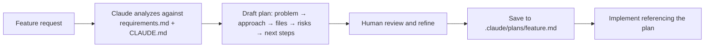

# AI Workflow — Support Ticket Management (backend-node)

This document describes how we use AI (primarily **Claude Code**) across the full software development lifecycle for this Node.js / Express / TypeScript backend.

| Phase | AI Role | Primary Artifacts |
|-------|---------|-------------------|
| Context | Persistent project memory | [`CLAUDE.md`](../CLAUDE.md), [`.claude/rules/`](rules/) |
| Requirements | Edge-case discovery, acceptance criteria | [`.claude/requirements.md`](requirements.md), `.claude/plans/{feature}.md` |
| Planning | Architecture and file-level design | [`.claude/plans/`](plans/) |
| Code generation | Module scaffolding, business logic | `src/modules/{module}/`, `src/jobs/`, `src/storage/` |
| Validation | Lint, type-check, manual Non-Negotiables | ESLint, Prettier, Husky, `tsc`, [`.claude/settings.json`](settings.json) |
| Testing | Unit + integration test generation | [`.claude/rules/api-conventions.md`](rules/api-conventions.md#testing) |
| Debugging | Root-cause analysis, minimal fixes | Error stacks + `CLAUDE.md` |
| Code review | Pre-review checklist against rules | [`.claude/rules/`](rules/) |
| Security | Data boundary enforcement | `.sample.env` only — never `.env` |

---

## 1. Primary AI Tool

**Claude Code** (Anthropic) is the primary AI coding agent for this project.

| Artifact | Purpose |
|----------|---------|
| [`CLAUDE.md`](../CLAUDE.md) | Single source of truth — stack, architecture, Non-Negotiables, env vars, scripts. Loaded automatically at the start of every Claude Code session. |
| [`.claude/requirements.md`](requirements.md) | Full backend requirements (data model, endpoints, state machine, RBAC, notifications, attachments). |
| [`.claude/rules/`](rules/) | Persistent coding standards (TypeScript, API design, database, security, testing). |
| [`.claude/plans/`](plans/) | Architectural decisions and feature plans — the "why" behind prior work. |
| [`.claude/settings.json`](settings.json) | Project-level Claude Code configuration — permissions and automation hooks. |

Claude Code operates in the project directory and reads `CLAUDE.md` plus `.claude/` files to stay aligned with project conventions without re-explaining the stack each session.

### `.claude/settings.json` — Project Configuration

`.claude/settings.json` is Claude Code's project-level configuration file. It controls three things:

**1. `permissions.allow` — auto-approved tool calls**

Tool calls on this list run without a confirmation prompt. Scoped to safe, idempotent operations defined in `CLAUDE.md Scripts`:

| Pattern | Purpose |
|---------|---------|
| `Bash(npx tsc --noEmit*)` | Type-check without emitting |
| `Bash(npm run build*)` | Compile TypeScript |
| `Bash(npm run lint*)` | Lint check and auto-fix |
| `Bash(npm run format*)` | Format check and write |
| `Bash(npm run db:migrate*)` | Apply idempotent schema migrations |
| `Bash(npm run db:seed*)` | Insert admin seed (idempotent) |
| `Bash(npm run db:setup*)` | migrate + seed in one shot |
| `Bash(npm test*)` / `Bash(npm run test*)` | Run test suite |
| `Bash(npm run dev*)` | Start dev server |
| `Bash(git status*)` / `diff*` / `log*` / `branch*` / `show*` | Read-only git operations |
| `Bash(ls*)` / `find . *` / `grep*` | Read-only filesystem exploration |

`npm install` is **not** auto-allowed — adding dependencies requires an explicit confirmation prompt.

**2. `permissions.deny` — always-blocked tool calls**

Blocked regardless of instruction. Directly enforces `CLAUDE.md` Non-Negotiables and prevents irreversible operations:

| Pattern | Reason |
|---------|--------|
| `Bash(git commit --no-verify*)` | **Non-Negotiable #10** — Husky hooks must always run |
| `Bash(git push --force*)` / `Bash(git push -f*)` | Overwrites remote history |
| `Bash(git reset --hard*)` | Destroys uncommitted work |
| `Bash(git clean -f*)` | Destroys untracked files |
| `Bash(rm -rf*)` | Irreversible recursive delete |

**3. `hooks` — automatic shell commands on Claude Code events**

| Event | Trigger | Command | Why |
|-------|---------|---------|-----|
| `PostToolUse` | Any `Edit` or `Write` | `npx tsc --noEmit \| grep -E 'error TS\|Found [0-9]+ error'` | Surfaces type errors immediately after a file is changed, before the next edit compounds them |

The grep filter keeps output terse — only `error TS…` lines and the final count are shown, not the full compiler output.

---

## 2. Providing Project Context to the Tool

### Context hierarchy

```
CLAUDE.md
  ├── Stack & architecture overview
  ├── Non-Negotiables (10 hard rules)
  ├── Rules reference table → .claude/rules/*.md
  ├── Environment variable defaults (no secrets)
  ├── Docker infrastructure
  ├── npm scripts
  └── Plans index → .claude/plans/*.md

.claude/requirements.md
  ├── Data model (§3)
  ├── RBAC (§4)
  ├── Endpoint specifications (§5)
  ├── State machine (§7)
  ├── Caching rules (§9)
  └── Acceptance criteria (§13)
```

### What to share in a session

| Share | Do not share |
|-------|--------------|
| Feature description + acceptance criteria from requirements.md | `.env` file contents |
| Relevant schema from `src/db/schema.sql` | Production `JWT_SECRET` or DB passwords |
| Reference module (e.g. `auth/` as a pattern) | `password_hash` values or bcrypt outputs |
| `.sample.env` for local setup context | PII from tickets, users, or logs |
| Sanitized error stacks (strip emails, IPs, IDs) | Full production connection strings |

### Prompt pattern for context

```
I'm working on the backend-node project (see CLAUDE.md).
Feature: [describe feature]
Requirements: [paste relevant section from .claude/requirements.md]
Relevant schema: [paste table DDL from schema.sql]
Reference module: src/modules/auth/ (follow this pattern)
Constraints: follow Non-Negotiables in CLAUDE.md and .claude/rules/
```

### Why this works

- `CLAUDE.md` documents all env var **defaults** — Claude never needs the real `.env`.
- `.claude/requirements.md` is the canonical spec — reference it instead of re-stating requirements in prompts.
- `.claude/rules/` encodes decisions that would otherwise be repeated every session.
- `.claude/plans/` preserves rationale (e.g. why ESLint v10 flat config was chosen in [`backend-tooling.md`](plans/backend-tooling.md)).

---

## 3. AI for Requirement Analysis

Before writing code, use Claude to refine requirements against the existing schema and security model.

### Workflow

1. Reference the relevant section of `.claude/requirements.md` (not a restatement of it).
2. Paste the relevant `schema.sql` section (tables, ENUMs, indexes).
3. Ask Claude to identify gaps, edge cases, and RBAC implications.
4. Capture the refined acceptance criteria — save as a plan if the feature is non-trivial.

### Example prompt

```
Given the tickets table in src/db/schema.sql, the state machine in §7 of
.claude/requirements.md, and the RBAC matrix in .claude/rules/security.md,
analyze requirements for POST /api/v1/tickets.

List:
- Required request fields and Zod validations
- Role permissions (ADMIN / AGENT) and what is auto-set server-side
- Edge cases (empty title, invalid priority, unauthenticated access, client-supplied assignedTo)
- Acceptance criteria as a numbered checklist
```

### Output

A refined checklist such as:

- Authenticated users (ADMIN or AGENT) can create tickets; `created_by` set from JWT `sub`
- `title` required (1–500 chars, trimmed); `description` required (non-empty after trim)
- `priority` optional — defaults `MEDIUM`; must be a valid ENUM value if supplied
- `status` and `assignedTo` are **server-authoritative** — any client-supplied values are silently ignored
- `assignedTo` auto-set to the designated admin (never nullable after creation)
- Returns `201` with `{ success, data }` envelope per `.claude/rules/api-conventions.md`

Save non-trivial analyses as `.claude/plans/{feature}.md` before implementation.

---

## 4. AI for Planning and Design

### Plan-first workflow



### Plan template

Each plan in `.claude/plans/` should cover:

1. **Problem** — what we are building and why
2. **Approach** — libraries, patterns, module layout
3. **Files changed** — created / modified with brief purpose
4. **Key Decisions** — why specific approaches were chosen over alternatives
5. **Risks** — security, migration, breaking changes
6. **Next Steps** — ordered implementation checklist

### Example prompt

```
Create an implementation plan for the tickets module following CLAUDE.md and
the requirements in .claude/requirements.md §5.1–5.3 and §7.
Auth module (src/modules/auth/) is the reference pattern.
Output: problem, approach, files to create/modify, key decisions, risks, next steps.
Do not write code yet.
```

### Existing plans (reference)

| Plan | Scope |
|------|-------|
| [`backend-tooling.md`](plans/backend-tooling.md) | TypeScript migration, ESLint, Prettier, Husky |
| [`backend-database.md`](plans/backend-database.md) | PostgreSQL pool, Redis, lifecycle |
| [`backend-schema.md`](plans/backend-schema.md) | `users`, `tickets`, `comments` DDL |
| [`auth-validation-upload.md`](plans/auth-validation-upload.md) | Zod, Passport, Multer, security middleware |
| [`schema-alignment.md`](plans/schema-alignment.md) | ENUM casing fixes, `CANCELLED`/`URGENT`, `NOT NULL`, `attachments` table |
| [`tickets-module.md`](plans/tickets-module.md) | Tickets CRUD, state machine, RBAC, comments, search/filter |
| [`notifications-email.md`](plans/notifications-email.md) | Direct (non-queued) SMTP email notifications; auto-close removed from scope |
| [`attachments-module.md`](plans/attachments-module.md) | File upload/download/delete, storage abstraction (local + S3) |

### Requirements-to-plan gap checklist

Before implementing any feature from `.claude/requirements.md`, verify the plan accounts for:

| Requirement area | Key check |
|-----------------|-----------|
| RBAC | Only `ADMIN` and `AGENT` roles exist — no `user` role |
| ENUM values | All DB enums use uppercase (`OPEN`, `IN_PROGRESS`, `ADMIN`, etc.) — see `schema-alignment.md` |
| State machine | Only transitions in §7 are valid; `PATCH /status` enforces them |
| Auto-assignment | `assignedTo` is always server-set on create (never null); client-supplied value silently ignored |
| Async notifications | Email delivery is a direct, non-queued, fire-and-forget call — failures log, never throw |
| Storage | Attachment bytes never go to Postgres or Redis; only metadata in Postgres, bytes in storage backend |
| Error codes | Domain errors include a machine-readable `code` field (e.g. `INVALID_STATUS_TRANSITION`) |

### Resuming work

In a new session, reference the plan directly:

```
Follow .claude/plans/tickets-module.md.
Implement the service layer only (ticket.service.ts).
Do not touch routes or controllers yet.
```

---

## 5. AI for Code Generation

### Module pattern (routes → controller → service)

Every domain module under `src/modules/{module}/` follows the same layering defined in `CLAUDE.md`:

```
{module}.routes.ts      → HTTP verb + path → controller only
{module}.controller.ts  → parse req → call service → send response
{module}.service.ts     → business logic + DB/cache/queue calls
{module}.schemas.ts     → Zod validation schemas (when needed)
```

### Notification pattern (direct call, no queue)

```
src/jobs/notifications.ts → sendNewTicketEmail(), sendCommentNotificationEmail() — direct calls
src/jobs/mailer.ts        → nodemailer transport factory (SMTP / jsonTransport in test)
```

Services call notification functions directly after DB commits — never in controllers.
Calls are fire-and-forget (wrapped in try/catch; errors are logged, never re-thrown to
the caller, and never retried). No job queue (BullMQ or otherwise) is used —
`src/config/queue.ts` / `src/jobs/queues.ts` are dead code pending removal (`task.md`
Phase 7/8 cleanup).

### Storage pattern

```
src/storage/index.ts    → IStorageBackend interface + createStorage() factory
src/storage/local.ts    → LocalStorage implementation (dev/test)
src/storage/s3.ts       → S3Storage implementation (prod)
```

Selected via `STORAGE_BACKEND` env var. Call sites import the `storage` singleton from
`src/storage/index.ts` only — never instantiate a backend directly.

### Example prompt

```
Generate the tickets service layer for src/modules/tickets/.
Follow auth module style. Use query<T>() from src/config/postgres.ts.
Use parameterized SQL ($1, $2). Never SELECT *.
Use success()/error() from src/utils/response.ts in the controller.
Follow all Non-Negotiables in CLAUDE.md and .claude/plans/tickets-module.md.
```

### Constraints Claude must respect (Non-Negotiables)

1. Never read `process.env` outside `src/config/index.ts`
2. Never interpolate values into SQL — always `$1, $2, ...`
3. Never `SELECT *` — name columns; never return `password_hash` or `storage_key`
4. Never put SQL in controllers or route files
5. Always use `success()` / `error()` — no raw `res.json()`
6. Always `next(err)` in controller catch blocks
7. Always `return` after calling `error()`
8. TypeScript `strict: true` — no `any`
9. Prefix unused params with `_`
10. Never `git commit --no-verify`
11. Enqueue jobs from services only — never from controllers; always wrap in try/catch
12. Never store attachment bytes in Postgres or Redis; never return `storage_key` in responses

### Incremental generation

Generate one layer at a time (schemas → service → controller → routes) and validate after each step. This reduces drift from project conventions.

---

## 6. Validating AI-Generated Code

AI output is a draft. Every change passes through a layered validation gate before merge.

### Automated checks

```
1. TypeScript compiler  →  npx tsc --noEmit
2. ESLint               →  npm run lint
3. Prettier             →  npm run format:check
4. Husky pre-commit     →  blocks commit if 1–3 fail
5. Test suite           →  npm test
```

### Manual Non-Negotiables checklist

After automated checks pass, verify:

- [ ] No `process.env` outside `src/config/index.ts`
- [ ] All SQL uses `$N` placeholders — no string interpolation
- [ ] Named columns in every `SELECT` — no `SELECT *`
- [ ] `password_hash` never returned from any service or query
- [ ] `storage_key` never returned in any API response (internal only)
- [ ] SQL only in `*.service.ts` — not in controllers or routes
- [ ] Controllers use `success()` / `error()` only
- [ ] Every `catch` block calls `next(err)` — no `res.status(500).json()`
- [ ] `return` after every `error()` call
- [ ] No `any` types; no unjustified `!` assertions
- [ ] New endpoints follow `/api/v1/{resource}` and response envelope from `.claude/rules/api-conventions.md`
- [ ] Domain errors include a `code` field (e.g. `INVALID_STATUS_TRANSITION`, `NOT_FOUND`)
- [ ] Status transitions validated against the state machine table (§7 of requirements); invalid ones return `409`
- [ ] Queue adds are fire-and-forget (in try/catch) — never block the API response
- [ ] `assignedTo` is never accepted from the client on ticket creation — always server-set

### Fix loop

If validation fails, paste the linter/tsc output back to Claude with:

```
Fix these errors. Minimal change only. Follow CLAUDE.md Non-Negotiables.
[paste errors]
```

---

## 7. AI for Testing

Testing strategy is defined in the Testing section of [`.claude/rules/api-conventions.md`](rules/api-conventions.md#testing).

### Stack

`jest` + `supertest` + `ts-jest` · isolated DB `ttn_stm_test` · co-located `*.test.ts`

### Coverage targets

| Layer | Minimum |
|-------|---------|
| Services | 90% |
| Controllers | 80% |
| Middleware / Utils | 100% |
| Job workers | 80% |

### Example prompt — unit tests

```
Write Jest unit tests for src/modules/tickets/ticket.service.ts.
Mock query from src/config/postgres.ts with jest.mock.
Cover: createTicket (auto-assigns to admin, ignores client-supplied assignedTo),
transitionStatus (valid transition succeeds, invalid returns 409 with INVALID_STATUS_TRANSITION).
Follow .claude/rules/api-conventions.md (Testing section). Assert status code first, then envelope shape.
```

### Example prompt — integration tests

```
Write Supertest integration tests for PATCH /api/v1/tickets/:id/status.
Use test DB ttn_stm_test (NODE_ENV=test).
Assert: 200 on valid transition (OPEN → IN_PROGRESS);
409 + { code: 'INVALID_STATUS_TRANSITION' } on invalid transition (OPEN → CLOSED);
401 on missing token; 403 when AGENT tries to transition a ticket they don't own.
Follow assertion order from testing.md (status first).
```

### Notification testing (TEST-7)

```
Write tests for sendNewTicketEmail()/sendCommentNotificationEmail() using jsonTransport
(NODE_ENV=test captures sent mail) — direct function calls, no queue/worker.
Assert new-ticket send: sends to creator + admin, de-duplicated if same person.
Assert comment-notification send: excludes comment author from recipient set.
```

### Attachment testing (TEST-9)

```
Write Supertest tests for POST /api/v1/tickets/:id/attachments using local storage.
Assert: allowed MIME type accepted (201); disallowed type rejected (415);
oversize file rejected (400); caller without ticket access gets 403;
download streams correct bytes; delete restricted to uploader or admin.
```

### Test data

Use factory functions in `tests/factories.ts` — never duplicate inline literals across test files.

---

## 8. AI for Debugging

### Workflow

1. Reproduce the error locally (`npm run dev` or `npm test`).
2. Collect: error stack, failing file, request payload (sanitized), relevant config snippet.
3. Paste to Claude with explicit constraint: minimal fix only.

### Example prompt

```
Debug this error in the tickets module.

Error:
[paste stack trace — redact emails and IDs]

File: src/modules/tickets/ticket.controller.ts

Context: CLAUDE.md Non-Negotiables apply.
What is the root cause and the minimal fix?
```

### Common issues Claude catches in this codebase

| Symptom | Typical root cause |
|---------|-------------------|
| `Cannot set headers after they are sent` | Missing `return` after `error()` |
| `500` with raw JSON in response | `res.status(500).json()` in catch instead of `next(err)` |
| SQL syntax error at runtime | String interpolation instead of `$N` params |
| `undefined` in query result | `SELECT *` column name mismatch — use explicit columns |
| Auth failure on protected route | Missing `authenticate` middleware or wrong JWT strategy |
| `409` never returned on bad transition | State machine check missing `FOR UPDATE` lock (race condition) |
| Email sent synchronously / blocks response | Queue add not fire-and-forget; missing try/catch around enqueue |
| `storage_key` visible in API response | Attachment service returning full row instead of safe columns |

### After fix

Re-run `npx tsc --noEmit`, `npm run lint`, and the relevant test before committing.

---

## 9. AI for Code Review

Claude supplements — never replaces — human code review.

### Pre-review prompts

**General review:**

```
Review this diff against CLAUDE.md Non-Negotiables and .claude/rules/.
List violations by severity (blocker / warning / suggestion).
[paste diff or file paths]
```

**Security review:**

```
Audit src/modules/tickets/ against .claude/rules/security.md and .claude/rules/db-conventions.md.
Check: RBAC on each endpoint (ADMIN / AGENT only), Zod validation,
no password_hash or storage_key leakage, parameterized SQL,
state machine enforced in transaction, error code field on domain errors.
```

**SQL injection audit:**

```
Are all SQL parameters in src/modules/tickets/ticket.service.ts
using $N placeholders? Flag any string interpolation.
```

### Review checklist (human + AI)

| Check | Reference |
|-------|-----------|
| Response envelope `{ success, data/message }` | `.claude/rules/api-conventions.md` |
| Domain errors include `code` field | `.claude/rules/api-conventions.md` |
| Correct HTTP status codes (incl. `409` for state machine, `415` for bad MIME) | `.claude/rules/api-conventions.md` |
| RBAC per role (`ADMIN` / `AGENT`) — no `user` role | `.claude/rules/security.md` |
| Parameterized queries, named columns, no `password_hash` or `storage_key` returned | `.claude/rules/db-conventions.md` |
| State machine transitions validated inside a transaction (`FOR UPDATE`) | `.claude/plans/tickets-module.md`, `.claude/rules/db-conventions.md` |
| Queue adds are fire-and-forget (in try/catch); never block the response | `.claude/plans/notifications-email.md` |
| Attachment bytes never in Postgres/Redis; `storage_key` never in API response | `.claude/rules/db-conventions.md`, `.claude/plans/attachments-module.md` |
| `next(err)` + no raw `res.json()` in catch | `CLAUDE.md` Non-Negotiables |
| Tests for new service/controller/worker logic | `.claude/rules/api-conventions.md` (Testing section) |

Human reviewer approves the PR. AI output is a pre-review checklist.

---

## 10. Information to Avoid Sharing with AI

### Never share

| Category | Examples |
|----------|----------|
| Secrets | `.env`, production `JWT_SECRET`, Redis password, DB credentials |
| Credentials | Real admin passwords, API keys, TLS private keys, S3 secret keys |
| Sensitive data | `password_hash` values, `storage_key` paths, user emails, ticket content with PII |
| Production infra | Live connection strings, internal hostnames, S3 bucket names, deployment keys |

### Safe to share

| Category | Examples |
|----------|----------|
| Project docs | `CLAUDE.md`, all `.claude/rules/`, `.claude/plans/`, `.claude/requirements.md` |
| Schema | `src/db/schema.sql` (no row data) |
| Config shape | `.sample.env`, env var table from `CLAUDE.md` |
| Code | Source files, sanitized diffs |
| Errors | Stack traces with emails, IPs, and IDs redacted |

### Sanitization example

```
# Before sharing
Error: duplicate key "users_email_key" for user admin@company.com at 192.168.1.5

# After sanitization
Error: duplicate key "users_email_key" on users.email INSERT
```

---

## 11. Reusing This Workflow in a Real Project

This workflow is portable. To adopt it on a new Node/Express (or similar) project:

### Setup checklist

1. **Create `CLAUDE.md`** — stack, architecture diagram, Non-Negotiables, env table, scripts.
2. **Add `.claude/requirements.md`** — full backend requirements spec before writing any code.
3. **Add `.claude/rules/`** — copy and adapt: `security.md`, `api-conventions.md`, `db-conventions.md`.
4. **Start `.claude/plans/`** — one plan per feature before implementation.
5. **Wire quality gates** — ESLint, Prettier, Husky pre-commit (`lint` + `format:check` + `tsc`).
6. **Add `.claude/settings.json`** — allowlist safe npm/git commands; deny `--no-verify` and destructive ops; add tsc PostToolUse hook.
7. **Use Non-Negotiables as PR checklist** — paste into PR template or review bot.
8. **Keep `CLAUDE.md` living** — update after every architectural decision.

### Files to copy verbatim (then customize)

```
CLAUDE.md
.claude/workflow.md                  ← this document
.claude/requirements.md              ← replace with your project's requirements
.claude/rules/
.claude/settings.json                ← update allowed scripts to match your package.json
.husky/pre-commit
.sample.env
```

### Files to customize per project

| File | What to change |
|------|----------------|
| `CLAUDE.md` | Stack, DB name, module list, env defaults |
| `.claude/requirements.md` | Full requirements for your system |
| `.claude/rules/security.md` | RBAC matrix, auth strategy, roles |
| `.claude/rules/api-conventions.md` | URL prefix, response envelope, TypeScript style, test DB name, coverage targets |
| `.claude/rules/db-conventions.md` | DB name, Redis prefix, queue names |
| `.claude/plans/` | Start empty; one plan per feature |

### Session rhythm (repeatable)

```
1. Read CLAUDE.md + .claude/requirements.md + relevant plan
2. Analyze requirements against schema and rules (Section 3)
3. Confirm or create plan — run gap checklist (Section 4)
4. Generate code incrementally: schemas → service → controller → routes (Section 5)
5. Validate: tsc → lint → format → manual checklist (Section 6)
6. Generate tests — unit + integration + worker (Section 7)
7. Debug if needed (Section 8)
8. AI pre-review + human review (Section 9)
9. Commit (never --no-verify)
```

### Scaling to a team

- **Onboarding:** New developers read `CLAUDE.md` + `.claude/workflow.md` + `.claude/requirements.md` on day one.
- **Consistency:** All AI sessions reference the same rules — output stays aligned across contributors.
- **Auditability:** Plans in `.claude/plans/` document why decisions were made, not just what was built.
- **Security:** Team agreement on Section 10 boundaries — no secrets in prompts, ever.

---

## Related Files

| File | Role |
|------|------|
| [`CLAUDE.md`](../CLAUDE.md) | Project context for every AI session |
| [`.claude/requirements.md`](requirements.md) | Full backend requirements spec |
| [`.claude/workflow.md`](workflow.md) | This document — AI workflow across the SDLC |
| [`.claude/settings.json`](settings.json) | Claude Code permissions and automation hooks |
| [`.claude/rules/`](rules/) | Persistent coding and security standards |
| [`.claude/plans/`](plans/) | Feature and architecture decision records |
| [`.sample.env`](../.sample.env) | Safe env template for local setup |
